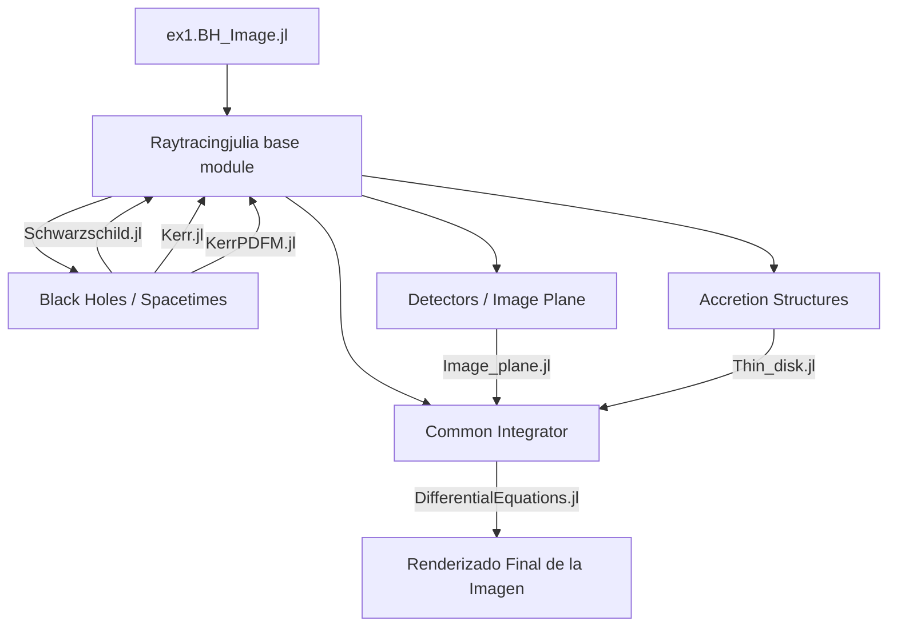

# Arquitectura y Flujo de Datos: Raytracingjulia

Este documento detalla el ciclo completo de ejecución del motor de trazado de rayos relativista **Raytracingjulia**, explicando cómo nacen los fotones en el observador, cómo curvan sus trayectorias según la métrica del agujero negro y cómo intersecan con las estructuras de acreción para formar la imagen final.

---

## 1. Topología de Módulos (Diagrama de Arquitectura)

El código sigue las mejores prácticas de **Despacho Múltiple** (Multiple Dispatch). Un módulo "núcleo" dicta las reglas generales, y submódulos independientes proveen la física específica.

---

## 2. Flujo Paso a Paso de la Simulación

La simulación funciona **"hacia atrás"** (Backwards Ray-Tracing). En lugar de emitir luz desde el agujero negro y esperar que caiga en la cámara del observador (lo cual es ineficiente), se *lanzan* fotones desde la cámara y se calcula matemáticamente de dónde provienen en el disco de acreción.

### Paso 1: Configuración del Escenario Físico
El usuario inicializa en su script (`ex1.jl`) tres elementos fundamentales:
1. **Un Agujero Negro (Spacetime)**: Entidades como `KerrBH` o `SchwarzschildBH` que contienen la estructura geométrica ($M, a, r_{EH}, r_{ISCO}$).
2. **Un Disco de Acreción (Acc_structure)**: Entidades como `ThinDisk` que proporcionan un perfil radial de cómo el gas caliente emite luz. En el disco delgado se usa el perfil termodinámico de Novikov-Thorne.
3. **Una Pantalla Sensora (Detector)**: Situada a una distancia $D$ con un ángulo de inclinación $\iota$. Se define un mosaico de píxeles espaciales $(\alpha, \beta)$.

---

### Paso 2: Nacimiento del Fotón (Mapeo de Bardeen)
Ubicación: `src/detectors/image_plane.jl` -> `photon_coords()`

Por cada píxel en la cámara, debemos crear un "Rayo Luminoso" (objeto `Photon`). El detector proyecta cada píxel $(\alpha, \beta)$ a un rayo de luz nulo utilizando un **Tétrada Local de Observadores Estáticos (ZAMO)** (Formalismo de Bardeen).

1. **Posición Inicial ($x^\mu$)**:
   La posición 3D real orientada hacia el horizonte es mapeada a las coordenadas de Boyer-Lindquist:
   - Radio inicial: $r = \sqrt{\alpha^2 + \beta^2 + D^2}$
   - Inclinación inicial: $\theta = \arccos\left( \frac{\beta \sin\iota + D \cos\iota}{r} \right)$
   - Dejando que $t = 0$.

2. **Momento Nulo ($k^\mu$)**:
   Se calcula la métrica local ($g_{\mu\nu}$) y se resuelven las ecuaciones del cuadrimomento impidiendo que la partícula tenga masa estática ($m = 0$): 
   $$ \mathcal{H} = \frac{1}{2} g_{\mu\nu}k^\mu k^\nu = 0 $$
   De aquí se extrae el vector inicial de estado de 8 dimensiones: $(t, r, \theta, \phi, k_t, k_r, k_\theta, k_\phi)$. Para retener el máximo rendimiento, se inyecta directamente a un `SVector{8}`.

---

### Paso 3: Integración Geodésica Hacia Atrás en el Tiempo
Ubicación: `src/common/common.jl` -> `geodesics_integrate()`

Con los fotones creados, se inicia un bucle de paralelismo agresivo (`@threads` en Julia). Se le exige a `DifferentialEquations.jl` que propague temporalmente el cuadrivector del fotón usando el **Hamiltoniano Geodésico**.

Para cada métrica (`Kerr.jl`, etc.), existe una función `geodesics(q, b, \lambda)` que dicta el sistema de **8 Ecuaciones Diferenciales Ordinarias (EDOs)**:
- $\frac{dx^\mu}{d\lambda} = g^{\mu\nu}p_\nu$
- $\frac{dp_\mu}{d\lambda} = -\frac{1}{2} (\partial_\mu g^{\alpha\beta}) p_\alpha p_\beta$

El integrador `Tsit5` (Runge-Kutta de orden 5 modificado) empuja al fotón iteración por iteración hacia el agujero negro.

---

### Paso 4: Detección de Colisión Discreta (Callbacks)
A medida que el fotón es integrado paso a paso hacia el abismo, Julia supervisa simultáneamente ciertas condiciones (`ContinuousCallback`):
1. **Condición de Disco (`disc_cond`)**: Revisa constantemente si el fotón cruza el plano ecuatorial del agujero negro ($\theta = \frac{\pi}{2}$). Esto se evalúa vigilando si $\cos\theta = 0$.
   - **Afectación**: Si lo cruza, y está entre los bordes numéricos $r_{in} < r < r_{out}$, el integrador **Pausa / Termina** la ecuación. Ha impactado luz.
2. **Condición de Horizonte (`horizon_cond`)**: Si el rayo de luz cruza numéricamente por debajo del radio orbital $r_+ + \epsilon$ (absorbido por completo).
   - **Afectación**: Termina la integración y asocia una intensidad de $0$ (Luz negra).
3. **Condición de Escape (`escape_cond`)**: Si el rayo se dispersa infinitamente e ignora por completo al agujero.
   - **Afectación**: Intensidad de $0$.

---

### Paso 5: Cálculo Astrofísico Final (Efecto Doppler Relativista)
Ubicación: `src/common/common.jl` -> `doppler_shift()`

Cuando el fotón impacta exitosamente al plasma giratorio, se captura su radio exácto $r_{impacto}$ y su cuadrimomento final $k^\mu_{impacto}$:
1. Averiguamos cuánta luz intrínseca emite el plasma en ese anillo a través del perfil termodinámico en `ThinDisk.jl` calculando su flujo $F(r) \equiv I_0$.
2. Dado que el plasma rota violentamente cerca de la velocidad de la luz (con frecuencia Angular Kepleriana $\Omega_K$), la luz está profundamente afectada por el corrimiento al azul / rojo (Doppler).
3. Se aplica el Invariante de Liouville ponderado por el factor Relativista ($g$):
   $$ g = \frac{\nu_{\text{observada}}}{\nu_{\text{emitida}}} = \frac{(p_\nu u^\nu)_{obs}}{(p_\nu u^\nu)_{emitida}} $$
4. La intensidad devuelta definitiva para ese píxel de cámara es $I = I_0 \cdot g^3$.

Este valor es mapeado en `img.image_data[i, j]` finalmente produciendo tu matriz 2D final en el código fuente.

---

### Conclusión Final de Flujo
1. Pre-cálculo ($(\alpha, \beta)$ de cámara a $p^{\mu}_0$).
2. Cáculo multi-hilo en EDOs de Kerr/Schwarzschild.
3. Evento interceptado (Disco) o Absorbido (Horizonte de eventos).
4. Relativismo Lumínico (Redshift/Blueshift en el plasma).
5. Renderización térmica (`Plots.heatmap`).
